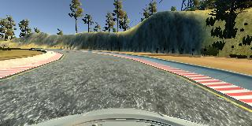
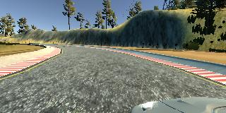
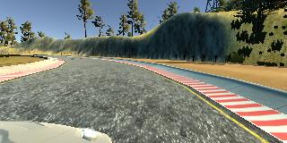

# Behaviorial Cloning Project

This repository contains files for the Behavioral Cloning Project.
Submission includes a `model.py` file, `drive.py`, `model.h5` a writeup report and `video.mp4`

The model uses python generator and can be used to successfully operate the simulation.


Model Architecture
---
I use model from NVidia. This neural network contains:
* Normalization layer
* 5 Convolutional layers
* 4 Fully-connected layers

On normalization layer I do image normalization and crop images.

This model use Adam optimizer.

```
model = Sequential()

model.add(Lambda(lambda x: x / 255.0 - 0.5, input_shape=(160,320,3)))
model.add(Cropping2D(cropping=((70,25), (0,0))))
model.add(Convolution2D(24,5,5, subsample=(2,2), activation='relu'))
model.add(Convolution2D(36,5,5, subsample=(2,2), activation='relu'))
model.add(Convolution2D(48,5,5, subsample=(2,2), activation='relu'))
model.add(Convolution2D(64,3,3, activation='relu'))
model.add(Convolution2D(64,3,3, activation='relu'))
model.add(Flatten())
model.add(Dense(100))
model.add(Dense(50))
model.add(Dense(10))
model.add(Dense(1))

model.compile(loss='mse', optimizer='adam')
model.fit_generator(train_generator,
                    samples_per_epoch=len(train_samples)*6, 
                    validation_data=validation_generator, 
                    nb_val_samples=len(validation_samples)*6, 
                    nb_epoch=7)
```


Training Strategy
---

For training I use data from three cameras: center, left, right


Center camera


Left camera 


Right camera

Data was collected from 5 laps:
* 3 careful laps mostly on the center of track
* one lap near the left side of track
* one lap near the right side of track

Also I added augmented data. Images and measurements of angle were copied and flipped.

#### Video

Attached video shows successful attempt of one lap driving.

